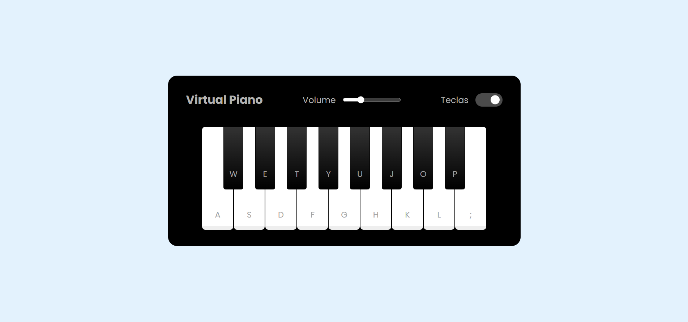

# 🎹 Dio JS Music Keyboard Virtual

Um **teclado musical virtual** desenvolvido com **HTML, CSS e JavaScript Vanilla**, onde você pode tocar notas tanto pelo **mouse** quanto pelo **teclado físico**.  
Projeto feito como parte dos desafios da [DIO](https://www.dio.me/).

---

## 🚀 Demonstração

👉 [Acesse o projeto online](https://catarinaguima.github.io/Dio-js-music-keyboard-virtual/)  

---

## ✨ Funcionalidades

✅ Tocar notas clicando com o **mouse**  
✅ Tocar notas usando o **teclado físico**  
✅ **Feedback visual** nas teclas ao serem pressionadas  
✅ Sons realistas de notas musicais  
✅ Interface simples e intuitiva  

---

## 🛠️ Tecnologias utilizadas

- **HTML5** → Estrutura da aplicação  
- **CSS3** → Estilização do teclado e layout responsivo  
- **JavaScript (Vanilla)** → Lógica de reprodução dos sons e interações  

---

## 📂 Estrutura do projeto

